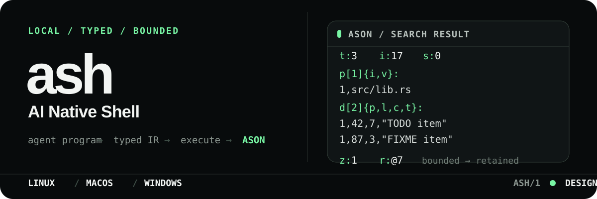
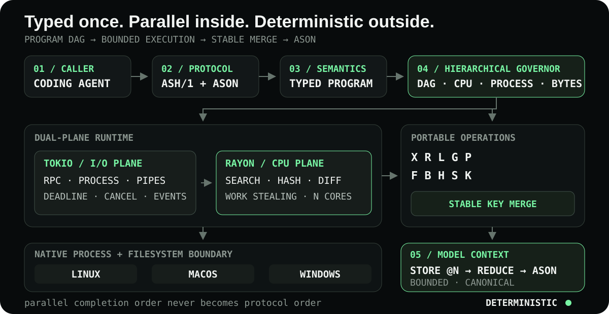

<p align="center">
  
</p>

<p align="center"><strong>AI Native Shell</strong> · typed parallel execution · compact model context</p>

<p align="center">
  <a href="https://a3s-lab.github.io/ash/">中文网站</a> ·
  <a href="https://a3s-lab.github.io/ash/en/">English docs</a> ·
  <a href="https://a3s-lab.github.io/ash/guide/install.html">Install</a> ·
  <a href="https://a3s-lab.github.io/ash/guide/protocol.html">ASH/1</a>
</p>

> [!IMPORTANT]
> `ash` is pre-release. Source builds now execute typed `exec`, `read`, `list`, `search`, compare-and-swap `patch`, durable file-only `fs` transactions, workspace `snapshot/delta`, and bounded dependency-graph `batch` requests; they also negotiate least-privilege capabilities, enforce session/action-bound one-time approval permits, evaluate retained-result data formulas, cancel active work, measure real search and snapshot paths across the Rayon worker matrix, and verify, activate, recover, or roll back signed releases. Cross-platform installers and a fail-closed six-target release workflow are implemented; release credentials are not provisioned and no supported signed binary release is published yet.

`ash` is a greenfield shell designed around coding agents rather than terminal users. It turns shell work into typed programs, executes independent work across bounded I/O and CPU planes, and returns only the evidence worth placing in an LLM context.

The [project website](https://a3s-lab.github.io/ash/) opens in Chinese by default, switches between Chinese and English plus `next` and frozen documentation versions, and uses a reduced-motion-aware terminal animation to walk through the implemented ASH/1 execution path.

## Proof starts at the result

The default LLM-facing representation is **ASON**, the native structured format designed and implemented by `ash` for LLM exchange. Homogeneous records are emitted in columns, paths are interned into compact dictionaries, and large or nested values become references instead of repeated text.

Conceptual search result:

```ason
t:3
i:17
s:0
p[1]{i,v}:
1,src/lib.rs
d[2]{p,l,c,t}:
1,42,7,"TODO item"
1,87,3,"FIXME item"
z:0
r:~
```

The schema for these short fields is negotiated once. Full output remains available through a bounded session reference; truncation is explicit instead of silently destructive.

Reference work is a typed prefix formula, not a mode plus unused options. This request computes `π_{p,l,t}(d[0:64])` over retained result `@7`:

```ason
a{p}:
[@7,d,0,64,p,l,t]
```

The same algebra uses `b/l/g/d/p/w` for byte slice, line slice, search, release, table projection, and workspace materialization. Each operator carries only its operands. `w` is capability-gated and uses the journaled, no-overwrite file transaction path.

## Why ash is different

- **Agent-first semantics.** Programs are typed graphs, not human-oriented command strings.
- **Token cost is a runtime concern.** Filtering, projection, deduplication, path interning, and output budgets happen before serialization.
- **Multi-core by design.** Independent graph nodes and repository partitions use a work-stealing compute pool while process and RPC I/O stay responsive.
- **Portable by construction.** Linux, macOS, and Windows share one semantic contract; platform behavior is isolated behind native backends.
- **Deterministic at the boundary.** Parallel workers may finish in any order; stable merge produces byte-identical canonical ASON.
- **Loss is visible.** Every omitted byte is recoverable by reference, and every reduced result declares its status.

## One runtime, two execution planes

<p align="center">
  
</p>

A persistent stdio session is the primary integration. One-shot calls use the same engine. Tokio owns RPC, child processes, pipes, deadlines, and cancellation; a fixed Rayon work-stealing pool owns search, hashing, diffing, reduction, and other splittable CPU work. A shared governor prevents a wide graph from multiplying inner parallelism beyond host and request budgets.

The externally visible path remains deterministic:

1. **Semantic IR** — typed programs, nodes, edges, values, budgets, and capabilities.
2. **Parallel runtime** — dependency-aware nodes plus bounded operation partitions.
3. **Stable merge** — logical path and position keys erase worker completion order.
4. **LLM presentation** — deterministic reduction followed by canonical ASON.

Read the complete contracts:

- [Website and versioned documentation](https://a3s-lab.github.io/ash/)
- [System architecture](./docs/architecture.md)
- [ASH/1 protocol and ASON specification](./docs/protocol.md)
- [Cross-platform distribution and one-click installation](./docs/distribution.md)
- [Release operator contract](./docs/releasing.md)
- [Token-efficiency benchmark contract](./docs/benchmarks.md)
- [Rust and dual-plane runtime decision](./docs/decisions/0001-rust-and-dual-plane-runtime.md)

## Cross-platform installation

> [!WARNING]
> No supported signed binary release exists yet. The Linux, macOS, and Windows release installers below are implemented and tested, but intentionally fail closed until the first signed release is published. The Cargo command builds the current source and is available now for development validation; it is not a signed release.

Linux and macOS (`x86-64` and `ARM64`):

```sh
curl --proto '=https' --tlsv1.2 -LsSf https://raw.githubusercontent.com/A3S-Lab/ash/main/install.sh | sh
```

Windows PowerShell (`x86-64` and `ARM64`):

```powershell
[Net.ServicePointManager]::SecurityProtocol = [Net.ServicePointManager]::SecurityProtocol -bor [Net.SecurityProtocolType]::Tls12
irm https://raw.githubusercontent.com/A3S-Lab/ash/main/install.ps1 | iex
```

Build the current source with Cargo:

```sh
cargo install --git https://github.com/A3S-Lab/ash --locked a3s-ash
```

Platform detection, pinned versions, custom prefixes, offline archives, checksum verification, transactional activation, and uninstall are covered by the [installation guide](https://a3s-lab.github.io/ash/guide/install.html).

## Verify the current baseline

```sh
git clone https://github.com/A3S-Lab/ash.git
cd ash
cargo test --workspace --all-targets
cargo run -p a3s-ash-bench --release --locked -- \
  --check benches/reports/v0.1.0/format.json
cargo run -p a3s-ash-bench --release --locked -- --runtime
npm --prefix website ci
npm --prefix website run check
```

Run one canonical request from the repository root:

```sh
cargo run -p a3s-ash -- run < spec/fixtures/ason/search-request.ason
```

The pinned Rust workspace currently verifies typed ASH/1 schemas, canonical framed handshakes, negotiated capability masks, action/session/policy/expiry-bound approval permits, replay rejection, concurrent `exec/read/list/search/patch/fs/snapshot`, acyclic batch graphs, dependency-failure skipping, stable child-response references, retained-result byte/line slicing, search, table projection, safe materialization, and release, chained workspace deltas, preemptive cancellation, atomic budgets, hierarchical permits, workspace-confined paths, direct argv launch with timeout-safe process-tree cleanup, deterministic multi-core preparation, and multi-file rollback. The runtime harness executes the public search and snapshot operations over one deterministic 8 MiB workspace at 1, 2, 4, 8, and host-available worker counts; different canonical ASON bytes fail the run before any timing is reported. Compare-and-swap patch replacement plus file-only create, copy, move, and remove transactions use digest guards, a checksummed on-disk journal, cross-process serialization, reverse rollback, durable commit markers, and restart recovery; create and destination paths additionally enforce no-overwrite semantics. Signed-release tests cover strict Ed25519 verification, sequence rollback/equivocation, the complete six-target manifest, exact archive shape, extraction ceilings, embedded binary identity, transactional activation, health-gated recovery, and reversible rollback. `ash self status|check|update|rollback|recover` uses canonical ASON, and network update input is HTTPS-only and byte-bounded. `ash rpc` executes independent requests concurrently while emitting final frames in stable input order. Offline installer smoke tests cover installation, integrity rejection, idempotent and forced reinstall, lock ownership, PATH ownership, rollback, and uninstall. Scheduled fuzzing covers canonical ASON, bounded ASH/1 framing, typed request decoding, and signed update metadata. This is still a development checkpoint, not a supported installation path.

## Release contract

The first usable release must ship as one native `ash` binary and include:

- persistent stdio RPC and one-shot invocation;
- direct process execution with cancellation, timeouts, and process-tree cleanup;
- bounded read, list, search, patch, filesystem mutation, snapshot, and algebraic result-reference operations;
- deterministic multi-core batch and dependency-graph execution with compact, retrievable node evidence;
- Linux and macOS `install.sh`, Windows `install.ps1`, verified release artifacts, self-update, and rollback;
- native builds for x86-64 and ARM64 on Linux, macOS, and Windows.

The release installer entrypoints are public so their contract can be tested, but they fail closed until signed binaries and clean-host end-to-end release evidence exist. The implemented entrypoints and remaining trust boundary are documented in the [distribution design](./docs/distribution.md).

## Repository ownership

`A3S-Lab/ash` is an independently buildable Rust workspace and release unit. The A3S umbrella repository consumes the same history as its `crates/ash` Git submodule, matching the existing A3S component model without turning the a3s root package into a Cargo workspace.

## Deliberate boundaries

`ash` is not a Bash, Zsh, PowerShell, or CMD compatibility layer. Version one does not include a human REPL, prompt themes, completion, aliases, interactive job control, an embedded model, remote execution, or a universal security sandbox.

It is a local execution boundary for coding agents. Workspace capabilities, resource limits, atomic file mutation, explicit approval permits, and structured errors are in scope; pretending that arbitrary child-process network and syscall isolation is portable is not.

## Delivery order

1. Stabilize the implemented vertical slice and its formula fixtures across Linux, macOS, and Windows.
2. Integrate the implemented capability-scoped permit API with trusted harness policy providers and freeze the protocol only when the first supported release is cut.
3. Accumulate sustained ASON/frame/update fuzz evidence and exhaust transaction, recovery, and scheduling crash points.
4. Provision protected release credentials and execute the implemented six-target signing, notarization, attestation, clean-host upgrade/rollback, and installer gates.
5. Gate release promotion on correctness, token cost, latency, cancellation, installer, upgrade, and benchmark evidence, and keep every proven integration revision pinned in the A3S submodule.

The first checked-in evidence is intentionally format-only: on its deterministic corpus, canonical ASON uses 62% of compact row-object JSON tokens under both pinned tokenizer profiles, while the closer columnar JSON baseline is reported alongside it. The real-operation runtime harness is reproducible locally but deliberately does not check host timing into source. Neither result is an agent-task claim. The report rules, runtime schema, remaining acceptance criteria, and accounting rules are defined in [docs/benchmarks.md](./docs/benchmarks.md).

## Contributing and support

Read [CONTRIBUTING.md](./CONTRIBUTING.md) before proposing behavior or protocol changes. Focused design questions, feature requests, architecture proposals, and reproducible bugs each have a structured issue form. General expectations are documented in [SUPPORT.md](./SUPPORT.md) and the [Code of Conduct](./CODE_OF_CONDUCT.md).

Do not report suspected vulnerabilities in a public issue. Follow the private reporting instructions in [SECURITY.md](./SECURITY.md).

## License

`ash` is available under the [MIT License](./LICENSE).
